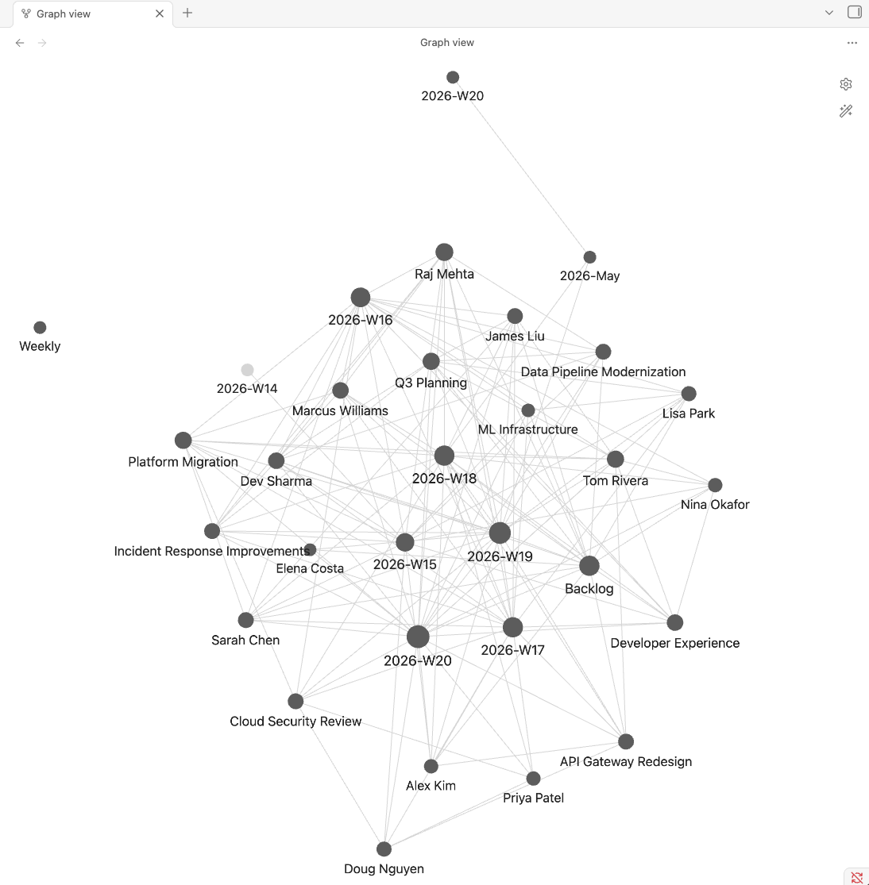
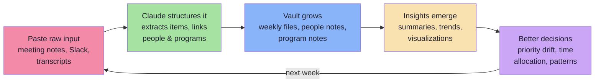
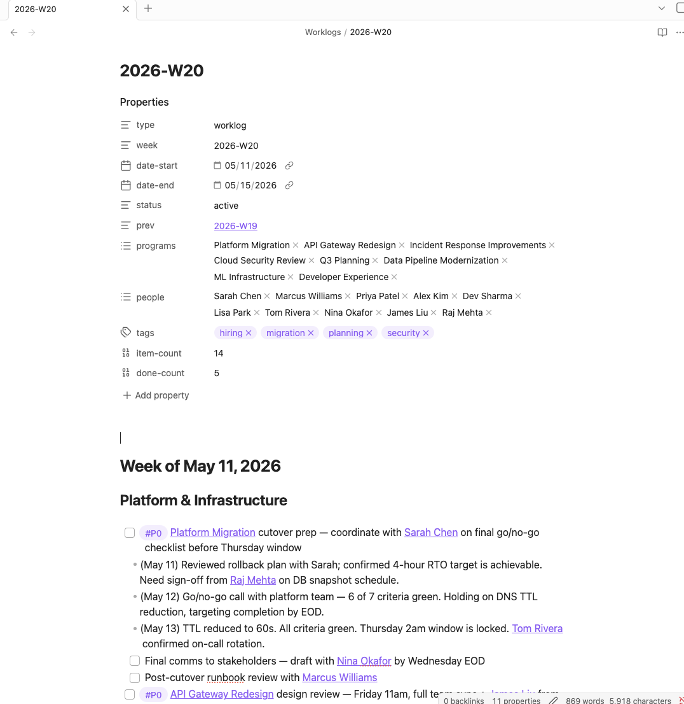
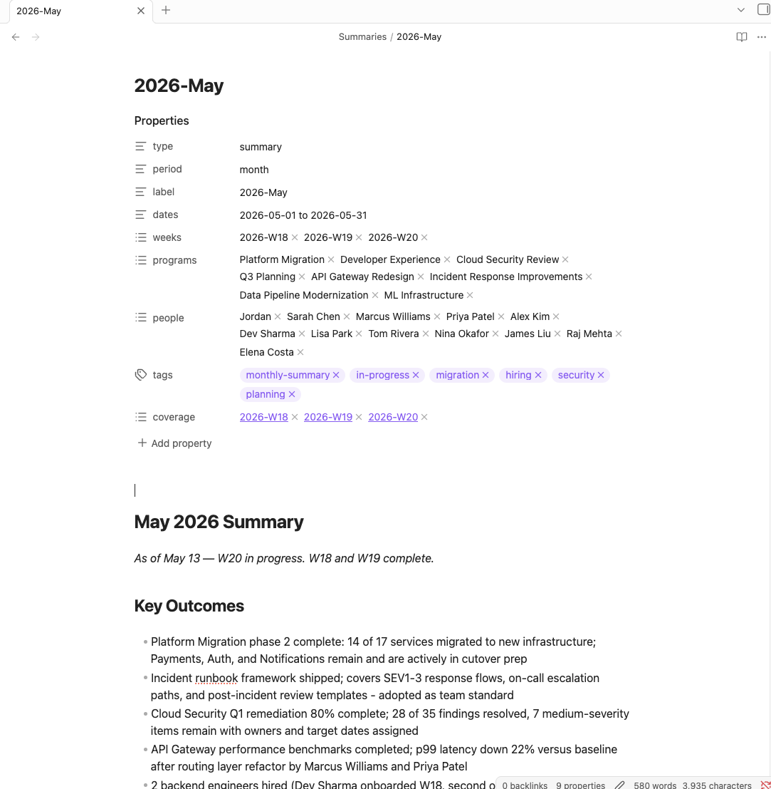
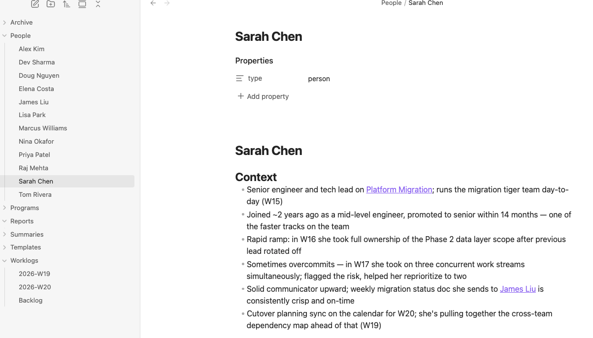
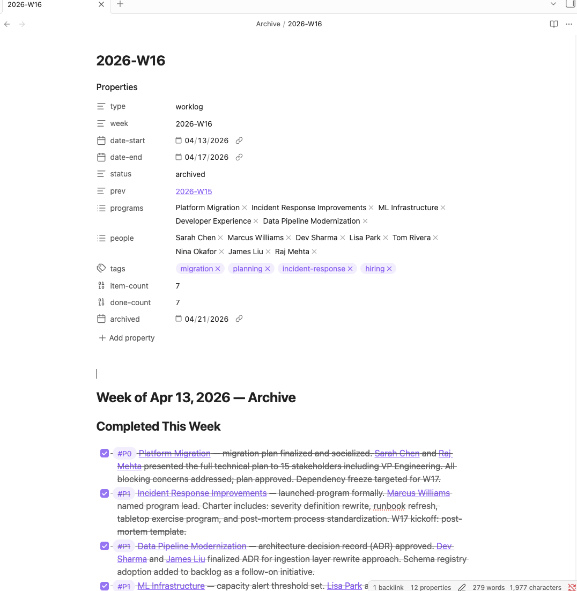

# obsidian-worklog

A [Claude Code](https://claude.ai/claude-code) skill that turns your Obsidian vault into a structured worklog with weekly planning, a people and program knowledge graph, priority tracking, D3 visualizations, and AI-powered summaries.

Built for anyone who tracks work across multiple projects and people. You paste in meeting notes, Slack threads, and raw context. Claude structures it, links it, and keeps it organized. Over time, your vault becomes a searchable history of what you did, who you worked with, and how your priorities evolved.

## Table of Contents

- [What You Get](#what-you-get)
- [The Workflow](#the-workflow)
- [Prerequisites](#prerequisites)
- [Quick Start](#quick-start)
- [How It Works](#how-it-works)
- [Vault Structure](#vault-structure)
- [Commands](#commands)
- [Working with Raw Input](#working-with-raw-input)
- [The Knowledge Graph](#the-knowledge-graph)
- [Dataview Queries](#dataview-queries)
- [Customization](#customization)
- [File Format Examples](#file-format-examples)
- [FAQ](#faq)
- [License](#license)

## What You Get

- **Weekly planning** with Monday rollover workflow and mid-week updates
- **Priority tracking** (P0/P1/P2) with status markers and dated progress notes
- **Knowledge graph** that auto-links people, programs, and teams across every note
- **Periodic summaries** (week/month/quarter) with priority drift analysis and trend detection
- **D3.js visualizations** of time allocation, program activity, and completion rates
- **Vault health checks** that find stale notes, stuck items, and missing links
- **Preferences as first-class citizens** -- the skill captures your voice and communication patterns (Slack DMs, status updates, meeting notes, etc.) as durable notes so you don't have to give the same feedback twice



## The Workflow

The worklog creates a virtuous cycle: raw input goes in, structured knowledge comes out, and the vault gets smarter every week.



**Monday:** `/worklog rollover` starts a new week, carries forward unfinished items.
**During the week:** Paste meeting notes, Slack messages, transcripts. Claude extracts items, links people and programs, dates everything.
**Anytime:** `/worklog summary` or `/worklog viz` to see where your time went.
**The graph grows:** Every person and program gets a note. Backlinks connect everything. Click any person to see every week they appeared in.

## Prerequisites

- [Claude Code](https://claude.ai/claude-code) (CLI, desktop, or IDE extension)
- [Obsidian](https://obsidian.md/) (any recent version)
- An Obsidian vault (existing or new -- `setup.sh` can create the structure for you)
- Recommended Obsidian plugins (install from Community Plugins):
  - **Templater** -- auto-fills dates in weekly file templates
  - **Periodic Notes** -- "Open weekly note" command + Calendar integration
  - **Calendar** -- sidebar calendar, click a week number to open that week
  - **Dataview** -- live query tables from your worklog frontmatter

## Quick Start

```bash
# 1. Clone the repo
git clone https://github.com/menottim/obsidian-worklog.git
cd obsidian-worklog

# 2. Run the interactive setup (configures paths, name, git identity)
./setup.sh

# 3. Copy to your Claude Code plugins directory
cp -r . ~/.claude/plugins/marketplaces/personal/plugins/obsidian-worklog

# 4. Restart Claude Code, then try it
```

```
/worklog status
```

If no current week file exists, Claude will tell you. Run `/worklog rollover` to create your first week.

### What setup.sh does

The setup script walks you through configuration:
- Asks for your Obsidian vault path (validates it exists, or offers to create the directory structure)
- Asks for your display name and git identity
- Optionally configures a git backup repo
- Copies the weekly template into your vault's `Templates/` directory

### Configure Obsidian plugins

Install each plugin from Settings -> Community Plugins -> Browse. After installing, toggle each one __ON__, then click the gear icon to configure.

#### Templater

| Setting | Value |
|---------|-------|
| Template folder location | `Templates` |
| Trigger Templater on new file creation | ON |
| Enable folder templates | ON |

Then under __Folder Templates__, add one entry:

| Folder | Template |
|--------|----------|
| `Worklogs` | `Templates/Weekly.md` |

This auto-fills the `tp.date` and `tp.file.title` expressions whenever a new file is created in `Worklogs/`.

#### Periodic Notes

| Setting | Value |
|---------|-------|
| __Weekly Notes__ | |
| Enable weekly notes | ON |
| Format | `YYYY-[W]WW` |
| Weekly note template | `Templates/Weekly.md` |
| Weekly note folder | `Worklogs` |

Leave daily, monthly, quarterly, yearly __disabled__ (the worklog skill handles those).

#### Calendar

| Setting | Value |
|---------|-------|
| Show week numbers | ON |
| Start week on | Monday |
| Confirm before creating new note | ON |

Calendar picks up weekly note settings from Periodic Notes. Clicking a week number in the sidebar opens or creates that week's file.

#### Dataview

| Setting | Value |
|---------|-------|
| Enable JavaScript Queries | ON |
| Enable Inline Queries | ON |

Everything else default. See [docs/dataview-queries.md](docs/dataview-queries.md) for ready-to-paste queries.

#### How the plugins work together

Calendar sidebar -> click week number -> Periodic Notes creates the file -> Templater fills in dates from the template -> Dataview queries pull live stats from frontmatter.

## How It Works

This is a Claude Code skill -- a markdown file ([SKILL.md](skills/worklog/SKILL.md)) that Claude reads as instructions. There is no runtime, no server, no API. Claude reads your vault files directly, follows the instructions to structure and link content, and writes the results back. The skill defines the file formats, linking conventions, and command behaviors.

## Vault Structure

The skill organizes your vault into these directories:

```
Your Vault/
  Worklogs/       One file per week (YYYY-[W]WW.md) + Backlog.md
  People/         One note per person, wiki-linked
  Programs/       One note per program/initiative, wiki-linked
  Teams/          One note per team, links members + parent org (optional)
  Preferences/    One note per voice / communication / style preference
  Archive/        Completed weeks in compact summary format
  Summaries/      Weekly, monthly, quarterly summaries
  Reports/        D3 visualization HTML files
  Templates/      Templater weekly template
```

`Teams/` adds a third dimension to the knowledge graph beyond People and Programs.
Set `team:` in a person's frontmatter to associate them, and `parent:` in a team's
frontmatter to link sub-teams under a larger org.

`Preferences/` captures voice and communication patterns the skill picks up on
across sessions - how you write Slack DMs, status updates, meeting notes, etc. The
skill checks this directory before drafting communication-shaped output, and offers
to capture new preferences when you give feedback that sounds durable.

Each weekly file uses YAML frontmatter with enriched fields that are auto-generated from the body:

```yaml
programs:    # wiki-linked programs mentioned in this week
people:      # wiki-linked people mentioned
tags:        # inferred from subgroup headings
item-count:  # total priority items
done-count:  # completed items
```

These fields enable [Dataview queries](docs/dataview-queries.md) for live dashboards inside Obsidian.



## Commands

| Command | What it does |
|---------|-------------|
| `/worklog` | Show active items grouped by priority |
| `/worklog review` | Monday morning item-by-item review (updates current week in place) |
| `/worklog rollover` | Create new week, archive previous, carry forward unfinished items |
| `/worklog add P1 <title>` | Quick-add an item, checks for overlaps |
| `/worklog tidy` | Cleanup suggestions: move done items, flag stuck items, dedup |
| `/worklog audit` | Vault health check with fix-it checklist |
| `/worklog search <term>` | Search across all vault files |
| `/worklog share` | Slack-ready summary copied to clipboard |
| `/worklog rollup` | IC-facing weekly context dump for a broad team channel |
| `/worklog summary [period]` | Impact summary for reporting up (week/month/quarter) |
| `/worklog viz [period]` | D3.js charts as standalone HTML |
| `/worklog sync` | Git backup: commit and push |

### Key commands in detail

**`/worklog review`** -- Walks through each active item for quick status updates ("done", "still on it", "pinged Sarah"). Collects new items. Updates the current week file in place. Does _not_ create a new week or archive anything -- use `/worklog rollover` for that.

**`/worklog summary [period]`** -- Generates an impact-oriented summary for reporting up. Accepts: `week`, `month`, `quarter`, or specific references like `W20`, `March`, `Q1`. Monthly and quarterly summaries include **Priority Drift** (how P0s shift over time) and **Trends** (time allocation, completion rates). Writes a wiki-linked vault file and copies a plain-text version to clipboard.

**`/worklog rollup`** -- Generates an IC-appropriate context dump of the current week for posting to a broad team channel (e.g. `#eng-all`). Organized into two buckets: _Stuff you should probably know_ (program-level updates, structural decisions, paved-road changes, things ICs can act on) and _Context: everything else_ (FYI-grade one-liners). Filters out performance commentary, 1:1 specifics, hiring candidate details, and other leader-only context. Slack-mrkdwn formatted; copied to clipboard.



**`/worklog audit`** -- Scans the vault for stale people notes (not mentioned in 4+ weeks), orphan programs, stuck items (3+ weeks without progress), missing wiki-links, empty stubs, and frontmatter gaps. Presents a checklist -- you pick which fixes to apply.

**`/worklog viz [period]`** -- Generates a standalone HTML file with four D3.js charts: time allocation pie, program activity heatmap, P0 trend line, and completion rate bars. Open in any browser. Dark theme, responsive layout.

## Working with Raw Input

The most common workflow: paste meeting notes, Slack threads, or transcripts directly into the conversation and ask Claude to add them to the worklog.

Claude will:
- Extract action items and decisions
- Match against existing items (adds sub-items, avoids duplicates)
- Wiki-link people and programs (creating stubs for new ones)
- Add dated annotations from the source content
- Update the current week file

Example:

```
here are notes from my 1:1 with Sarah:
- she's concerned about the migration timeline slipping
- wants to bring in a contractor for the gap
- Marcus is doing well picking up Dev's work

add to worklog
```

Claude adds these as sub-items under the existing migration item, wiki-links Sarah Chen and Marcus Williams, and dates the annotations.

## The Knowledge Graph

Every time Claude writes to the vault, it wiki-links all people, programs, and teams. This builds a dense knowledge graph in Obsidian:

- Click any person's note to see every week they appeared in (via backlinks)
- Click any program to see its full history across weeks
- Click any team to see its members and the work flowing through it
- The graph view shows how people, programs, and teams cluster together

**People notes** (`People/Sarah Chen.md`) accumulate context over time -- role, relationship, what you're working on together. New bullet points are added as substantive updates happen. The optional `team:` frontmatter property links a person to a team note.

**Program notes** (`Programs/Platform Migration.md`) track status evolution, key decisions, and who's involved.

**Team notes** (`Teams/Platform.md`) capture team membership and the work the team owns. The optional `parent:` frontmatter property links sub-teams to their parent org, so the graph can model nested team structures.

**Preference notes** (`Preferences/Slack DM Voice.md`) capture your voice and communication patterns -- how you write status updates, what tone you use in DMs, formatting conventions, things to avoid. Claude reads these before drafting any communication-shaped output, so your voice stays consistent across weeks instead of drifting back to a generic LLM register.

Claude creates stub notes for new people, programs, and teams automatically. The graph grows organically as your worklog evolves.



## Dataview Queries

With the Dataview plugin enabled, you can create live dashboards inside Obsidian. See [docs/dataview-queries.md](docs/dataview-queries.md) for 8 ready-to-paste queries covering weekly overviews, people engagement, program frequency, completion rates, and more.

## Customization

### Subgroups

Weekly files use bold labels for thematic subgroups that adapt to your work:

```markdown
**Platform & Infrastructure**

- **P0** ⏳ In Progress - Platform migration cutover planning
  - Confirmed rollback window with Sarah Chen (May 12)

**Hiring & People**

- **P1** ⏳ In Progress - Backend engineer pipeline
```

Common patterns: by domain, by team, by initiative type. The skill reorganizes them during review if themes shift.

### Priority levels

| Level | Meaning |
|-------|---------|
| **P0** | Must happen this week, blocking or critical |
| **P1** | Important, actively working on |
| **P2** | Tracking but not urgent, visibility items |

### Status markers

| Marker | Meaning |
|--------|---------|
| ⏳ In Progress | Actively working on |
| ✅ Done | Completed |
| 🔁 Ongoing | Recurring, no end date |

## File Format Examples

All files are standard Obsidian-compatible markdown with YAML frontmatter. See the [examples/](examples/) directory:

- [Weekly file](examples/weekly-file.md) -- active week with items and subgroups
- [Archive file](examples/archive-file.md) -- compact summary of a completed week
- [Person note](examples/person-note.md) -- accumulated context about a person
- [Program note](examples/program-note.md) -- program status over time
- [Summary file](examples/summary-file.md) -- period summary with drift and trends



## FAQ

**Do I need Obsidian to use this?**
The skill reads and writes plain markdown files, so technically no. But Obsidian's graph view, backlinks, and Dataview plugin are what make the knowledge graph and dashboards useful.

**Does this work with existing vaults?**
Yes. The skill creates its own directories (Worklogs/, People/, Programs/, etc.) within your vault. It won't touch your existing notes.

**How do I handle multiple projects?**
Use thematic subgroups within each week. The skill adapts subgroup labels to your current work -- you don't need separate vaults or files per project.

**Can I edit files directly in Obsidian?**
Absolutely. The skill reads the current file state before every change. Edit freely in Obsidian between Claude sessions.

**What happens if I miss a weekly rollover?**
Nothing breaks. Run `/worklog rollover` whenever you're ready. The old week stays in Worklogs/ until you roll it over.

**How much does the vault grow?**
Each week adds ~2-5 KB. After a year: 52 weekly files + 50-100 people + 20-30 programs = a few hundred KB total.

## License

MIT -- see [LICENSE](LICENSE).
